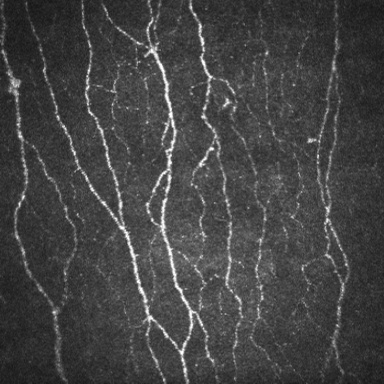
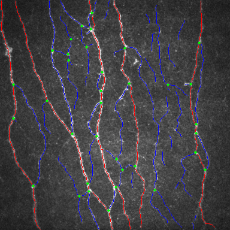

<h1 align="center">QCCMetrics</h1>
<p align="center">
    
</p>
<p align="center">
    <a href=""></a>
    <a href=""></a>
</p>

# Who am I?
> A corneal confocal microscope automatic quantitative tool for nerve fiber morphological parameters.

## 1. Environmental preparation
<hr>

```shell
conda create -n qccm python=3.8
conda activate qccm
pip install -r requirements.txt
```

## 2. Example
<hr>

### Create a processor object
```python
from process.processor import Processor
from utils.calculate import get_CNFL, get_CNFD, get_CNBD
from utils.common import show_image, save_image
from process.draw import draw_result_image


test_image_path = './assets/test.jpg'
segmenter_model_path = './models/nerve.onnx'
result_image_path = './assets/result.png'

p = Processor()
```

### Load the model and image
```python
p.set_model_path(segmenter_model_path)
p.load_model()
p.load_image(test_image_path)
```



### Then, just do it
```python
p.process()
```

### View the parameter calculation result
```python
print(f'CNFL: {get_CNFL(p)}\nCNFD: {get_CNFD(p)}\nCNBD: {get_CNBD(p)}')
```
Output:
```
CNFL: 31.15730381764782
CNFD: 31.249999999999993
CNBD: 93.74999999999999
```

### Result visualization
```python
result_image = draw_result_image(p.segments, p.nodes, p.image, 'none', 'bone')
show_image(result_image)
save_image(result_image, result_image_path)
```



## 3. Cite our paper
```
Awaiting Production Checklist
```


